<table class="tbl-heading"><tr><td class="td-logo">

July 30, 2019
</td>
<td class="td-banner">
# Lab 14: SettingUpGoldenGatetoReplicateDataFromOn-PremiseDatabaseToATP-Dedicated-using-Microservice-Image
</td></tr><table>

## Introduction

Data Replication is a essential part of your efforts and tasks when you are migrating your oracle databases. There are multiple ways to acheive this usecase. In this hands-on lab, we will be using Oracle Golden Gate to migrate data to the Autonomous Transaction processing - Dedicated (ATP-D) database. 

Why Golden Gate?

- Oracle Golden Gate is an enterprise grade tool which can provide near real time data replication from one database to another. 
- Oracle GoldenGate offers a real-time, log-based change data capture (CDC) and replication software platform to meet the needs of today’s transaction-driven applications. It provides capture, routing, transformation, and delivery of transactional data across heterogeneous environments in real time can be acheived using Golden Gate. 
- Oracle GoldenGate only captures and moves committed database transactions to insure that transactional integrity is maintained at all times. The application carefully ensures the integrity of data as it is moved from the source database or messaging system, and is applied to any number of target databases or messaging systems.

[Learn More](http://www.oracle.com/us/products/middleware/data-integration/oracle-goldengate-realtime-access-2031152.pdf)

To **log issues**, click [here](https://github.com/cloudsolutionhubs/autonomous-transaction-processing/issues/new) to go to the github oracle repository issue submission form.

## Objectives

- Setup real time data replication from on-premise database to ATP-D database instance.

## Required Artifacts

- Access to OCI console
- Access to on-premise source database with admin access.
- A pre-provisioned Autonomous Transaction Processing-Dedicated as target database.
- A pre-provisioned developer client image, with VNC Server installed and network access to both source and target database, to install Golden Gate on it.
- VNC Viewer or other suitable VNC client on your laptop.

## Background and Architecture

- To simulate the actual production environment, our ATP-D database is going to reside in a private network and will not be accessible from public internet where as the source database is going to reside in a public network (The source database can also be deployed in a private network but for simplicity we are going to deploy the source database in a public network).

- The Golden Gate software is going to be deployed on a linux server in a public network which has access to both the source database and the target database. 

- To connect and execute the Golden Gate configurations on the target database, we are going to deploy the OCI developer linux image from the OCI market place in a public network which has connectivity to the private betwork of the target database. This image is pre-configured with tools like Oracle Instant Client, Oracle SQL Developer, etc.

- To ensure connectivity between the public and the private network, we have configured the security lists as demonstrated in the previous labs of this workshop.


## Steps

### **STEP 1: Provision and setup the Developer Client Image from OCI Marketplace**

- Provision a Developer Client image from OCI marketplace. For steps to provision, refer the <a href="./ConfigureDevClient.md" target="_blank">Configure Dev Client</a> lab.

- Install VNC server on the developer client
    - ssh into the developer client as OPC user.

    ```
    ssh -i <ssh_private_key> opc@ip_address
    ```

    - As opc user, create vnc server.

    ```
    ]$ vncserver
    ```

- Log in to the developer client, using the VNC server client on your desktop, using the ip address and the port number.

    - On your local terminal window, do local port forwarding using the below command.

    ```
    ssh -i id_rsa -L 5901:127.0.0.1:5901 opc@<ip-address_dev_client> -N
    ```
    - using your VNC client, login into the VNC server.
    ```
    ipaddress_of_dev_client:5901
    ```

- **We are going to use this developer image later in this lab to connect to the ATP-D database and configure it to work with Oracle Golden Gate.**

### **STEP 2: Provisioning and Configuring the Golden Gate Microservices Image from OCI Marketplace**

**To provision the Golden Gate Microservices Image, please follow the below steps:**

1. Login to OCI Console

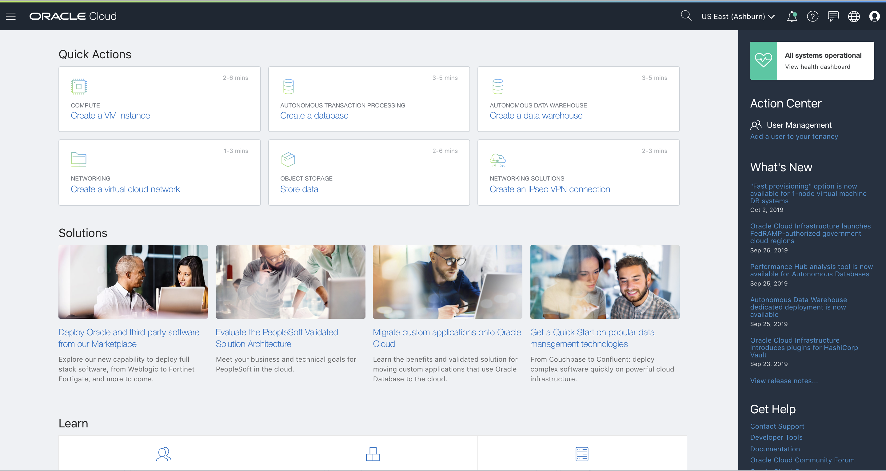

2. Click on the Hamburger menu on the top left corner of the screen.

3. Scroll down and select the Market place option from the menu.

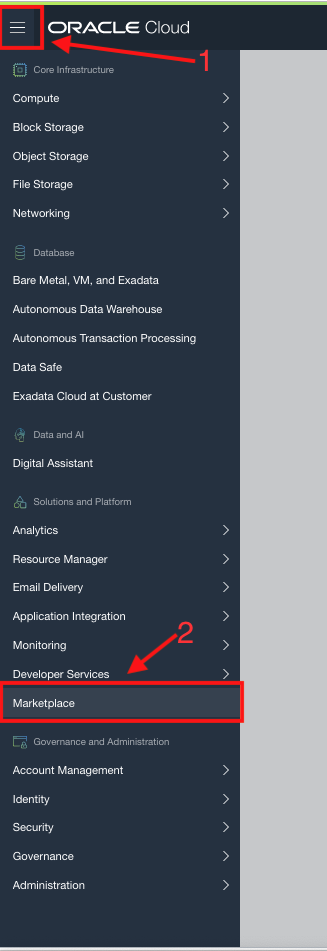

4. Now you will see the market place console. On the left side of the screen, in the type dropdown menu, filter using data integration option.

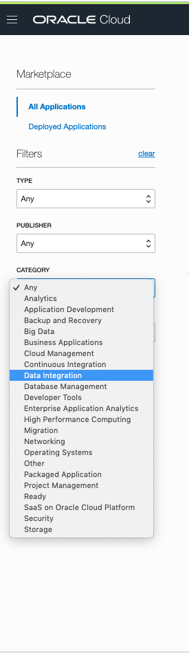

5. Select the Golden Gate Image.

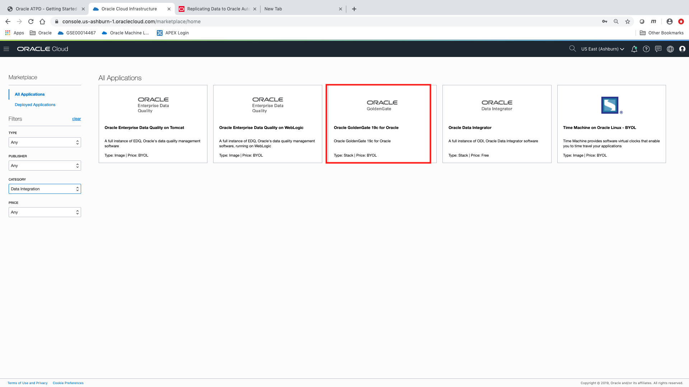

6. Select the compartment to deploy the golden gate image and click on Launch Stack button.

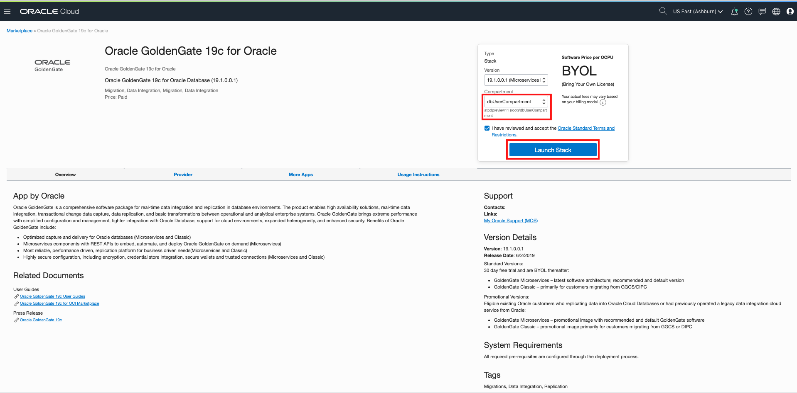

7. This GoldenGate Microservices image is deployed as a stack using terraform to automate the linux instance and Golden Gate installation. Enter the name for the stack that is going to be deployed. Please note that you need service limit to be available on your tenancy for VM shape 2.4 (minimum), to be able to provision this image.

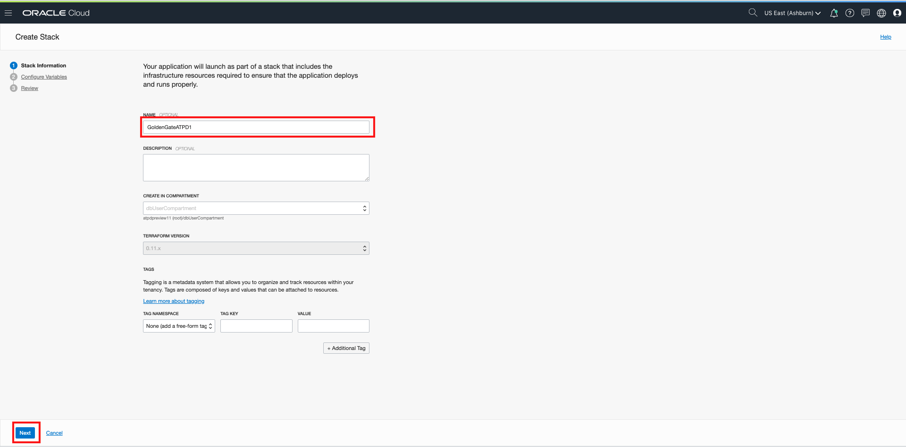

8. Click next.

9. Enter the display name for the compute instance which is going to be provisioned as a part of this stack to install golden gate software.

10. Enter a DNS host name for this instance.

11. Select the compartment, VCN and the subnet where the compute instance needs to be provisioned.

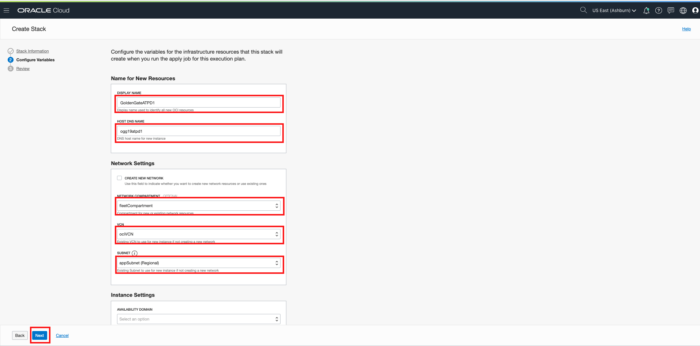

12. select the Availability Domain and the shape. For our usecase, we are going to select the checkbox "assign public ip address" as this compute instance needs to be in a public subnet to be able to access both the source and the target database.

13. Give the name and select the database version for source and target deployments.

14. Enter your ssh-key and click next, review the values entered and click submit.

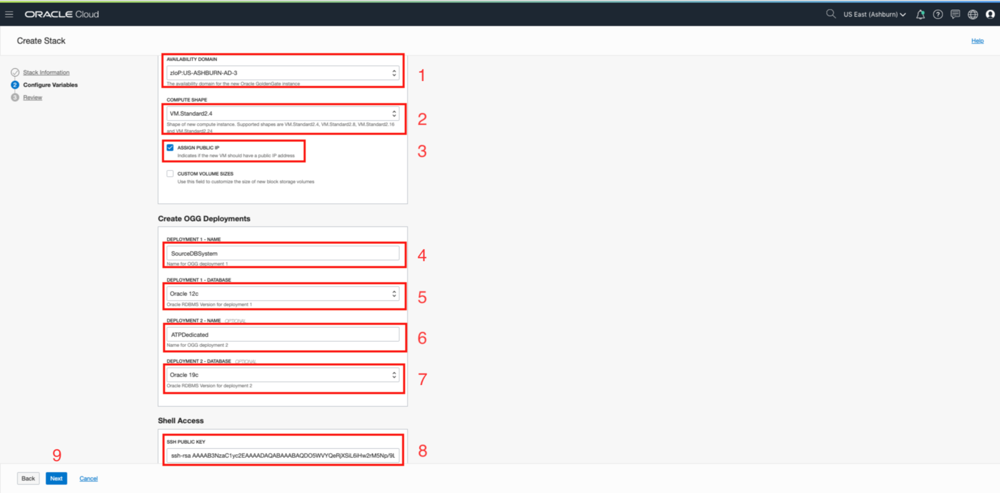

15. Once the stack is provisioned, navigate to compute instances from the hamburger menu and get the IP address of the Compute Instance.

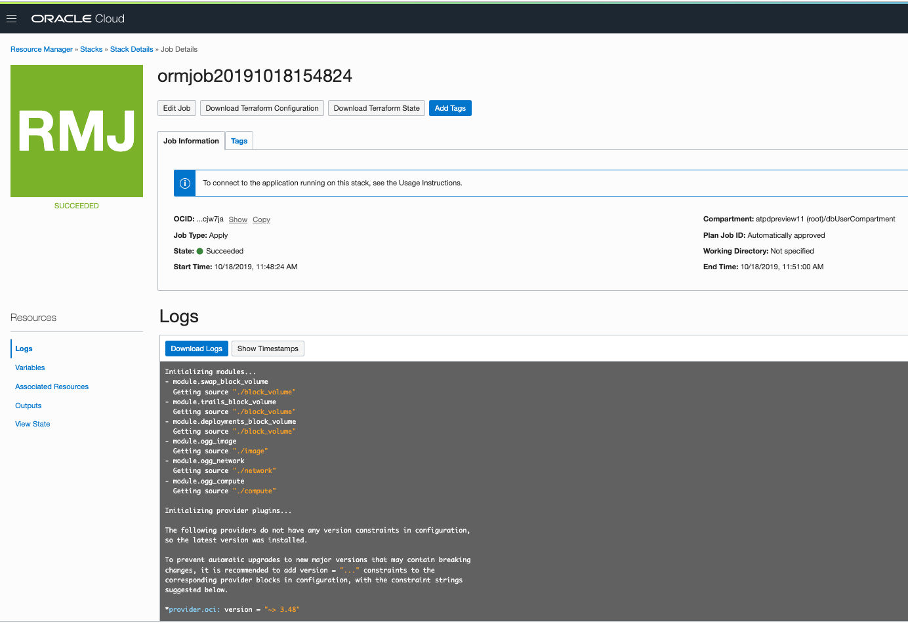
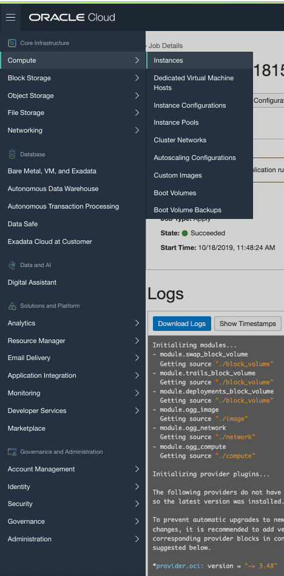
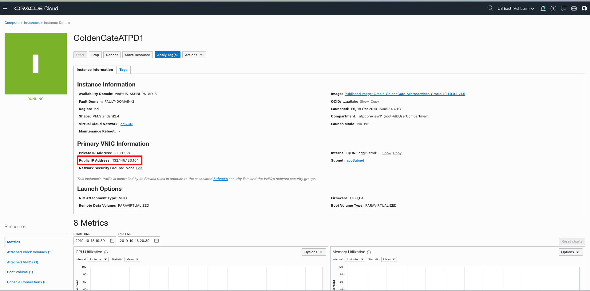


### **STEP 2: Configuring the source database, target database and Golden Gate Microservices Image**


**Source Database Configuration**

**In the source database we need to perform the following steps:**

**Steps**

1. Connect to the source database from your terminal using sql client or sql developer and create a new on-premises/source database user, create tables and load data, if you havent done already.

    Note:The example shown below is just for reference, you can use any user and table. For our lab, we are going to use user abdul and table supplier.

    ```
    sqlplus sys/<password>@pdb_name as sysdba
    ```

    ```
    CREATE user abdul IDENTIFIED BY WElCome12_34#;
    grant dba to abdul;
    ```

    ```
    DROP TABLE abdul.CRIME_DATA;
    CREATE TABLE "ABDUL"."CRIME_DATA" 
   (	"ID" NUMBER(38,0), 
	"REPORT_DAT" VARCHAR2(2600 BYTE), 
	"SHIFT" VARCHAR2(2600 BYTE), 
	"OFFENSE" VARCHAR2(2600 BYTE), 
	"METHOD" VARCHAR2(2600 BYTE), 
	"BLOCK" VARCHAR2(2600 BYTE), 
	"DISTRICT" NUMBER(38,0), 
	"PSA" NUMBER(38,0), 
	"WARD" NUMBER(38,0), 
	"ANC" VARCHAR2(2600 BYTE), 
	"NEIGHBORHOOD_CLUSTER" VARCHAR2(2600 BYTE), 
	"BLOCK_GROUP" VARCHAR2(2600 BYTE), 
	"CENSUS_TRACT" NUMBER(38,0), 
	"VOTING_PRECINCT" VARCHAR2(2600 BYTE), 
	"CCN" NUMBER(38,0), 
	"XBLOCK" NUMBER(38,0), 
	"YBLOCK" NUMBER(38,0), 
	"START_DATE" VARCHAR2(2600 BYTE), 
	"END_DATE" VARCHAR2(2600 BYTE)
   );
    alter database add supplemental log data;
    ```
    
    To verify that the tables exist in the schema abdul, we can connect sqldeveloper to the database or use sqlclient to connect and check the tables and the data exists.

    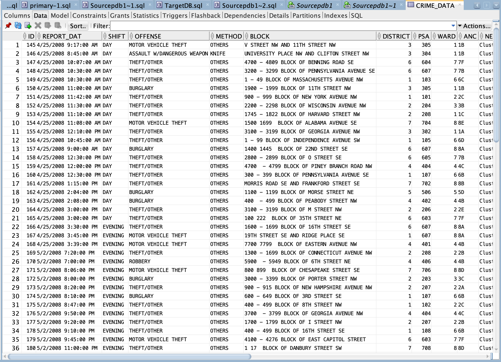

2. create a common user in the source database and grant golden gate previliges to the user.

    ```
    CREATE user abdul IDENTIFIED BY WElCome12_34#;
    grant dba, connect, resource to abdul;
    create user C##abdul identified by WElCome12_34#;
    grant dba to C##abdul;
    alter database add supplemental log data;
    exec dbms_goldengate_auth.grant_admin_privilege('C##abdul',container=>'all');
    show parameter ENABLE_GOLDENGATE_REPLICATION;
    alter system set ENABLE_GOLDENGATE_REPLICATION=true scope=both;
    ```


**Developer Image Configuration**

**In the Developer Image/Client  we provisioned in step 1, we need to complete the following:**

**Steps**

1. Get the ip address of the Developer client we provisioned earlier. Log into the developer client you provisoned earlier in this lab.

    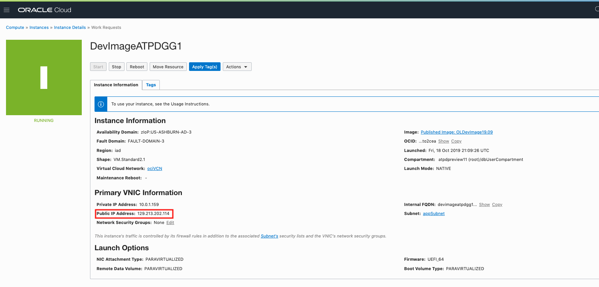

2. Download the ATP-D instance client credentials wallet.

    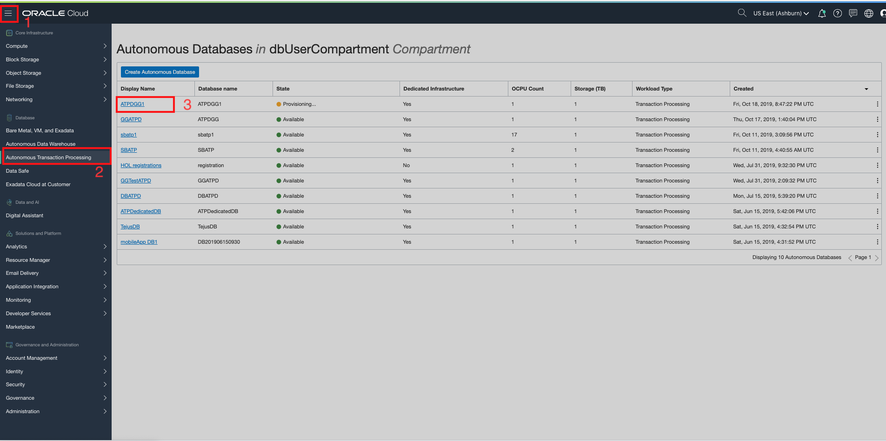
    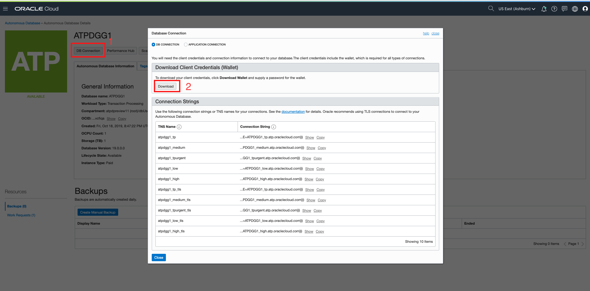
    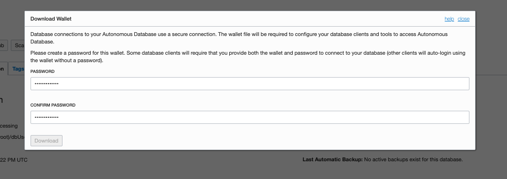

3. Transfer the credentials ZIP file that you downloaded.

    In the developer client,Open a terminal window and navigate to the folder where you downloaded the credentials zip file and unzip the client credentials zip file to \<oracle client location\>/network/admin folder.

    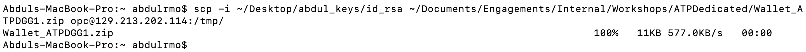
    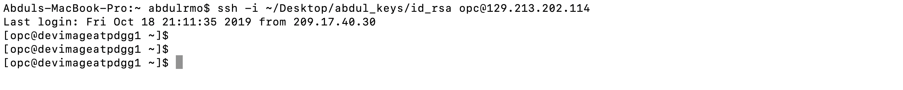
    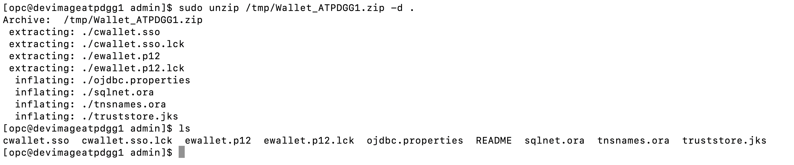

4. In your developer client instance bash profile, configure the environment variables as shown below and source the profile so that you do not have to manually set them again.

    Now, change user to oracle and open your bash profile.

    ```
    ]$ sudo su - oracle
    ]$ vi ~/.bash_profile
    ```

    Add the below lines to your bash profile and modify the values according to your machine as shown in the screenshot.

    ```
    export ORACLE_HOME="/usr/lib/oracle/18.5/client64/lib/"[Oracle Instant Client Path]
    export PATH=$PATH:<ORACLE_HOME PATH>/bin
    export TNS_ADMIN="<Oracle Instant Client Path>/network/admin"
    export LD_LIBRARY_PATH="<Oracle Instant Client Path>"

    ```

    Source the bash profile.

    ```
    ]$ source ~/.bash_profile
    ```

    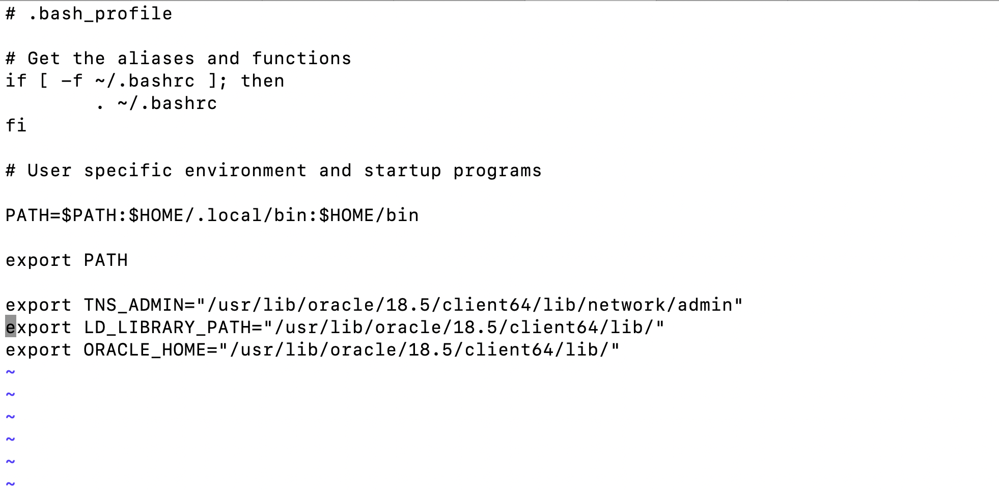

5. Now, To configure the connection details for source database,

    i. Open the sqlnet.ora file present in the same folder(i.e in Golden Gate Instance) and set the wallet location variable to the TNS_ADMIN path, as shown below:

    ```
    WALLET_LOCATION = (SOURCE=(METHOD=FILE)(METHOD_DATA=(DIRECTORY=$TNS_ADMIN)))
    ```

    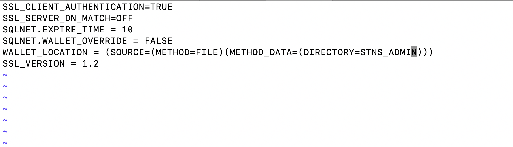

    ```
    cd $ORACLE_HOME/network/admin
    ls
    sqlnet.ora tnsnames.ora
    ```

    Note:

    The tnsnames.ora file provided with the credentials file contains three database service names identifiable as: ADB_Database_Name_low ADB_Database_Name_medium ADB_Database_Name_high For Oracle GoldenGate replication, use ADB_Database_Name_low. See Predefined Database Service Names for Autonomous Database Cloud

6. Check the connectivity by login into the database using sql client and then exit.

    Target Database:

    ```
    sqlplus admin/<password>@databasename_low
    exit
    ```

**Target Database Configuration**

**In the target database we need to perform the following steps:**

**Steps**

1. Log into your target database as your admin user.

    ```
    sqlplus admin/<db_admin_password>@databasename_low
    ```
    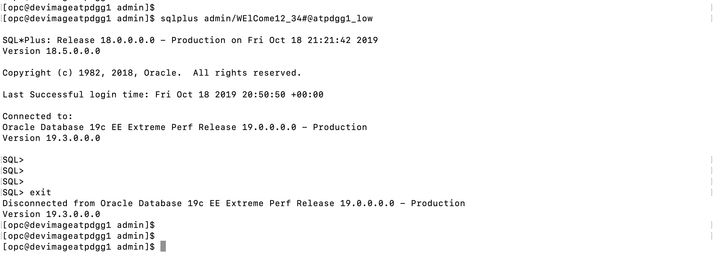

2. Create a new user for replication in the target Database.

    ```
    drop user abdul cascade;
    create user abdul identified by WElCome12_34#;
    alter user abdul quota unlimited on data;
    grant create session, resource, create view, create table to abdul;
    ```

    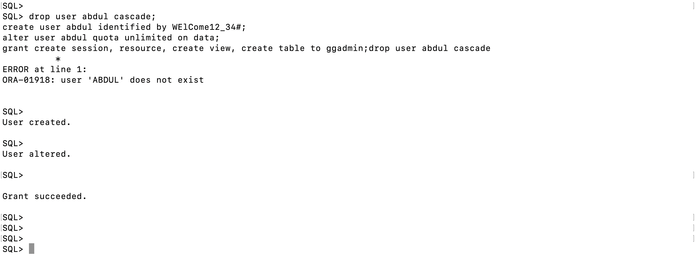

3. Unlock GGADMIN user and grant necessary previliges.

    ```
    alter user ggadmin identified by WElCome12_34# account unlock;
    alter user ggadmin quota unlimited on data;
    ```

    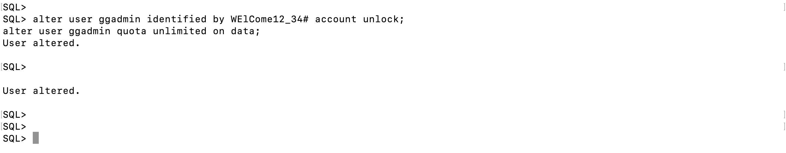

4. Create your replication tables.

    ```
    DROP TABLE abdul.CRIME_DATA;
    CREATE TABLE "ABDUL"."CRIME_DATA" 
   (	"ID" NUMBER(38,0), 
	"REPORT_DAT" VARCHAR2(2600 BYTE), 
	"SHIFT" VARCHAR2(2600 BYTE), 
	"OFFENSE" VARCHAR2(2600 BYTE), 
	"METHOD" VARCHAR2(2600 BYTE), 
	"BLOCK" VARCHAR2(2600 BYTE), 
	"DISTRICT" NUMBER(38,0), 
	"PSA" NUMBER(38,0), 
	"WARD" NUMBER(38,0), 
	"ANC" VARCHAR2(2600 BYTE), 
	"NEIGHBORHOOD_CLUSTER" VARCHAR2(2600 BYTE), 
	"BLOCK_GROUP" VARCHAR2(2600 BYTE), 
	"CENSUS_TRACT" NUMBER(38,0), 
	"VOTING_PRECINCT" VARCHAR2(2600 BYTE), 
	"CCN" NUMBER(38,0), 
	"XBLOCK" NUMBER(38,0), 
	"YBLOCK" NUMBER(38,0), 
	"START_DATE" VARCHAR2(2600 BYTE), 
	"END_DATE" VARCHAR2(2600 BYTE)
   );
    ```

    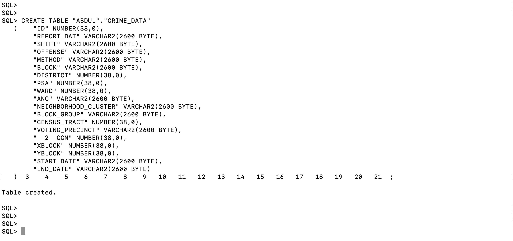

    Now try logging in to the target database using the "ggadmin" user.

    ```
    sqlplus ggadmin/<gg_admin_password>@databasename_low
    ```

**Golden Gate Configuration**

**In the Oracle GoldenGate Image, you need to complete the following:**


**Steps**

1. SSH into the Golden Gate Compute instance you provisoned in step 2.

2. Copy the ATP-D instance client credentials wallet into the Golden Gate Compute instance.

3. Transfer the credentials ZIP file that you downloaded from Oracle Autonomous Database console.

    In the Oracle GoldenGate instance,Open a terminal window and navigate to the folder where you downloaded the credentials zip file and unzip the client credentials zip file to "/u02/deployments/ATPDedicated/etc/" folder.

    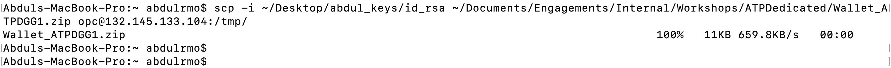
    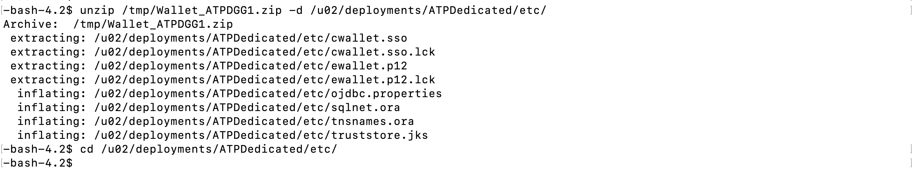

4. Now, To configure the connection details for source database,

    i. Copy the On-Premise/Source DB connection strings for both CDB and PDB into the tnsnames.ora file in /u02/deployments/ATPDedicated/etc location in the Oracle GoldenGate instance.

    ```
    **Sample Connection String**
    pdb1=(DESCRIPTION =(ADDRESS = (PROTOCOL = TCP)(HOST = ip address)(PORT = 1521))(CONNECT_DATA =(SERVER = DEDICATED)(SERVICE_NAME = pdb1.domain.oraclevcn.com)))
    ```

    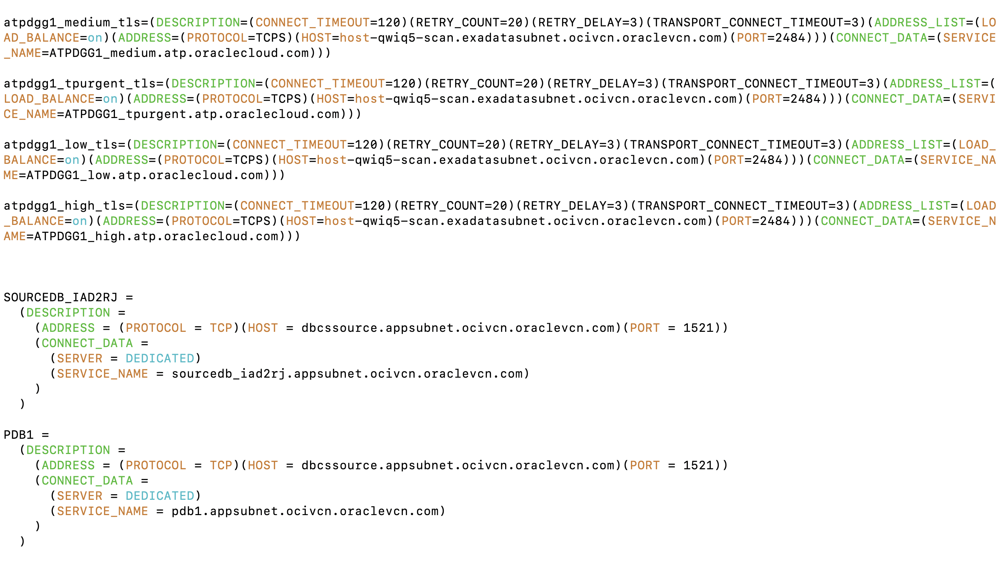


    ii. Open the sqlnet.ora file present in the same folder(i.e in Golden Gate Instance) and set the wallet location variable to the wallet path, as shown below:

    ```
    WALLET_LOCATION = (SOURCE=(METHOD=FILE)(METHOD_DATA=(DIRECTORY="/u02/deployments/ATPDedicated/etc")))
    ```

    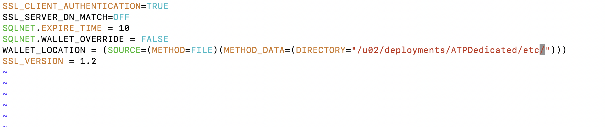

    ```
    cd /u02/deployments/ATPDedicated/etc
    ls
    sqlnet.ora tnsnames.ora
    ```

    Note:

    The tnsnames.ora file provided with the credentials file contains three database service names identifiable as: ADB_Database_Name_low ADB_Database_Name_medium ADB_Database_Name_high For Oracle GoldenGate replication, use ADB_Database_Name_low. See Predefined Database Service Names for Autonomous Database Cloud

5. Now, navigate to the home directory and open the ogg-credentials.json credentials file and save the username and password in a notepad. We will need it to login into the golden gate service manager console later.

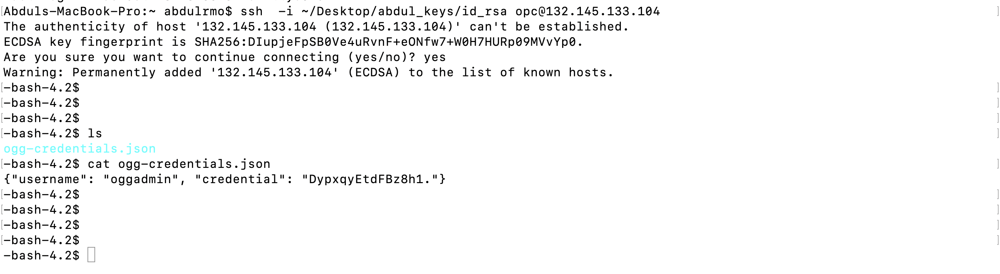


### **STEP 3: Configuring the extract and the replicat**

**In the Oracle GoldenGate Image, you need to complete the following:**


**Steps**

1. Connect to the Golden Gate Microservices - Service Manager by entering the URL in the browser like shown below:

    ```
    https://<ip-address of GG Microservices Compute Instance>
    ```
    
    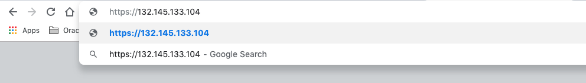
    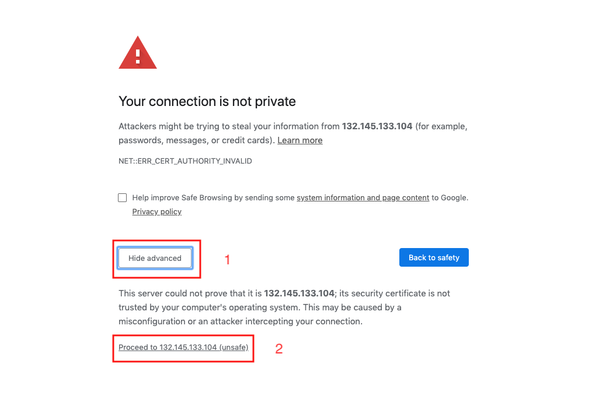
    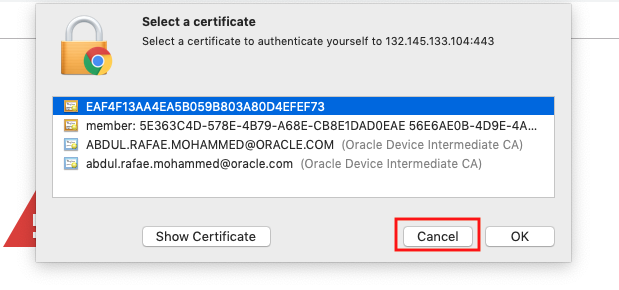

2. Use the credentials you saved earlier from the ogg-credentials.json file and login to the service manager.

    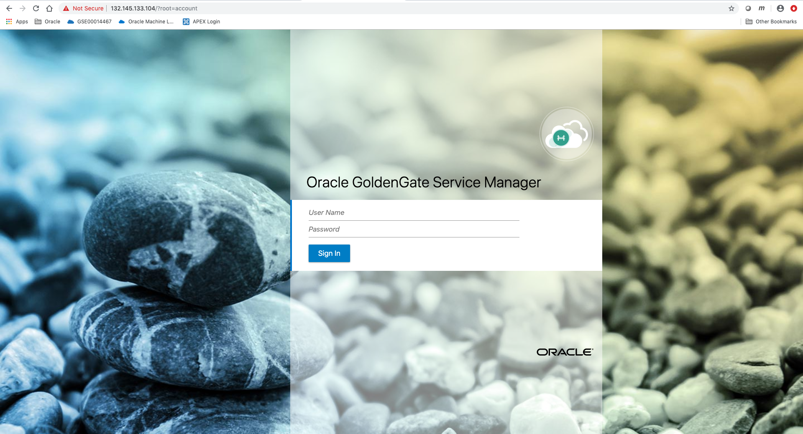
    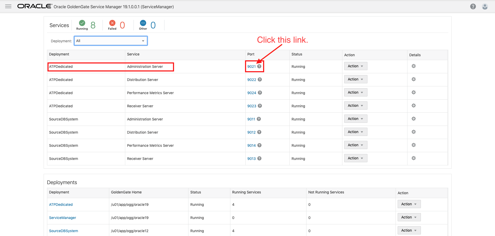

3. Login on the ATPDedicated database admin server by clicking on the respective port and using the same credentials which we saved earlier in this lab.

    

4. Then, click on the Hamburger menu on the top left corner and select the administrator tab from the menu.

    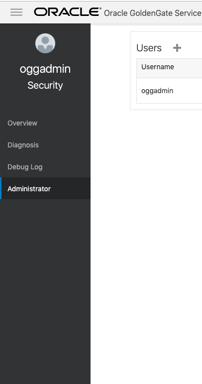

    Then, click on the edit option on the right hand side of the account name "oggadmin".

    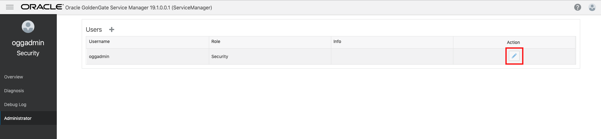

    Then, enter the account type, username and new password for the user oggadmin and click submit to change the password.

    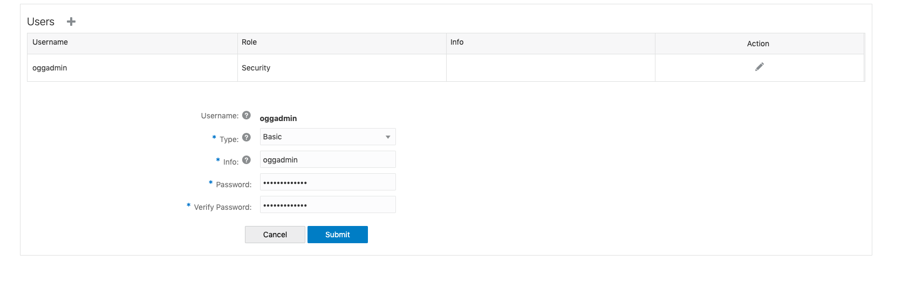

    Now you will be logged out automatically and have to login with the new password you just set.

5. Now, Click on the Hamburger menu on the top corner of the screen again and this time click on Configuration.

    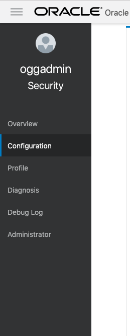

6. Click on the "+" button on the credentials section and add credentials for source database cdb and pdb user, ggadmin user of target atp-d database as shown below.

    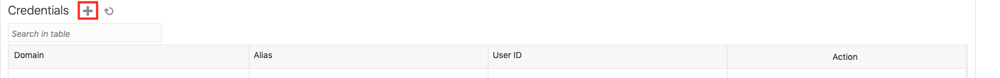
    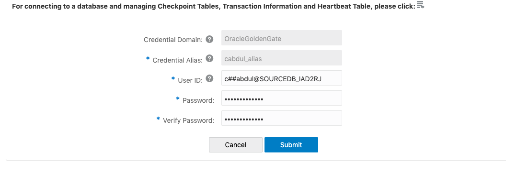
    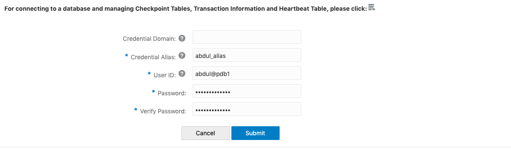
    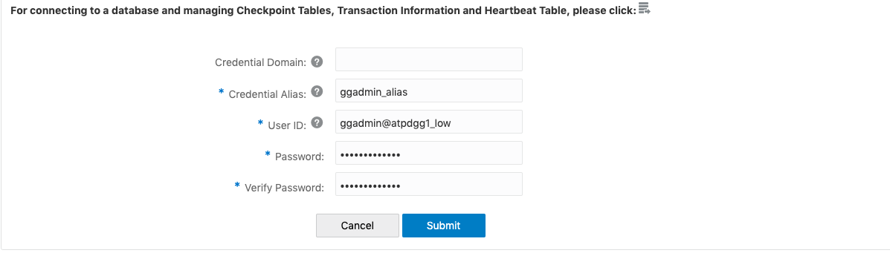
    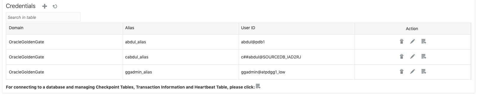

    Now, Test the connectivity by clicking on the logon button on the right side of the screen for each credential.

    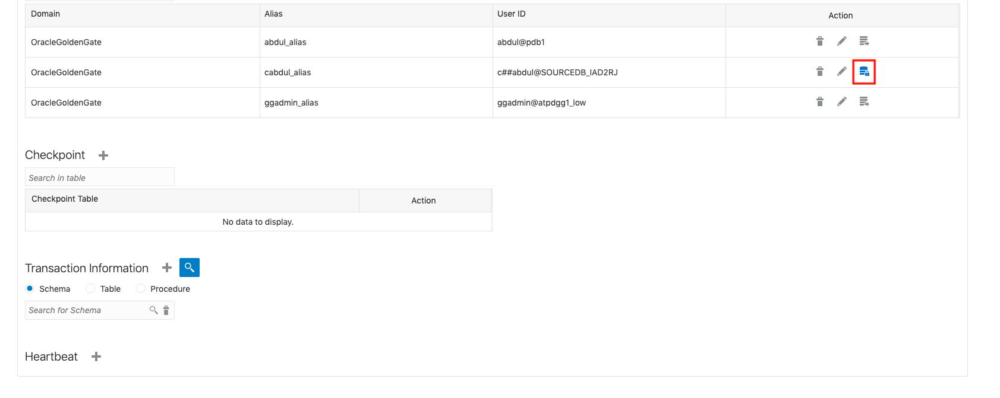
    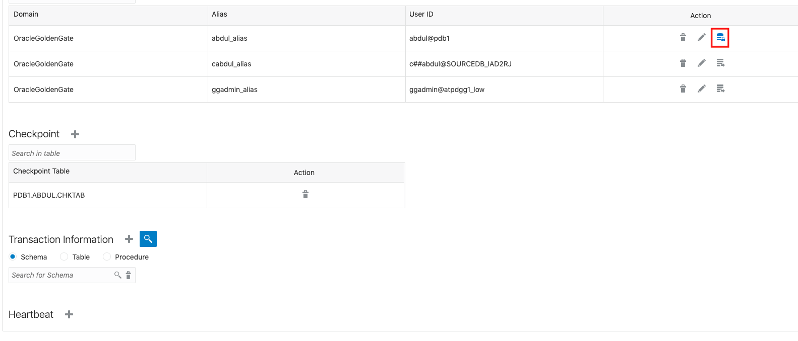
    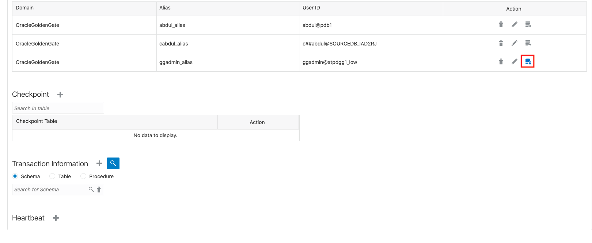

7. Now, click on the parameters tab on the top of the screen and add the checkpoint table parameter in the GLOBALS parameter file.

     ```
    GGSCHEMA ggadmin
    checkpointtable <db_name>_low.ggadmin.chktab
    ```

    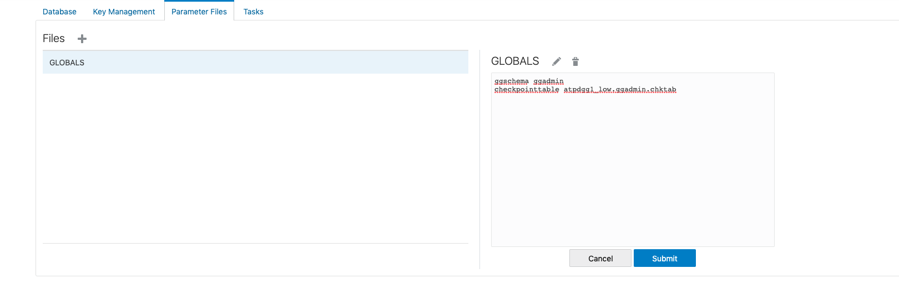


8. Click on the database tab, connect to the source database using the connect button beside the pdb user credentials we configured earlier and verify that the checkpointtable entry has been added in the checkpoint table section.

    
    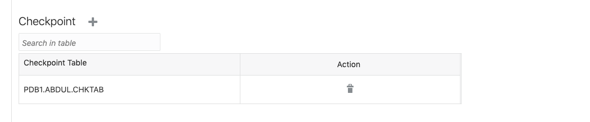

9. Add schema trandata by entering the schema name in the transaction section.

    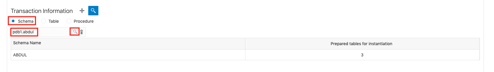

10. Connect to the ATPDedicated database using the connect button beside the ggadmin user credentials we configured earlier.

    

11. Verify if the checkpointtable appears in the checkpoint table section, if not then add it using the "+" button.

    

    Then, configure the heartbeat for the ATPD database using the default values.

    

12. Now, click on the hamburger menu and select Overview option.

    

13. Click on the "+" to add the extract. Select Integrated as the extract type.

    - Select the credential domain, credential name.
    - Enter the trail file name.
    - Select the pdb from the dropdown. 
    - Select "create and run" button to create and register the extract. 
    - Verify that the extract has all the necessary parameters as shown below.
    - click next and you should see the extract config as given below. If you see anything that is missing, you can also edit it directly in the box given there.

    ```
    extract ext1
    useridalias cabdul_alias domain OracleGoldenGate
    exttrail rt
    table pdb1.abdul.*;
    ```

    
    
    
    
    

14. Click on the "+" to add the replicat. Select NonIntegrated as replicat type. 


    - Select the credential domain, credential name.
    - Enter the trail file name. 
    - click next and you should see the replicat config as shown below.
    - Select "create and run" button to create and register the replicat.

    ```
    replicat rep1
    USERIDALIAS <ggadmin_alias> domain OracleGoldenGate
    map <source_pdb>.<source_schema>.<source_table>, target <target_schema>.<target_table>;
    ```

    
    
    
    
    


    Verify that both the extract and replicat are running.

    


### **STEP 3: Verifying the replication**

**Steps**

1. Login to the Source database and insert rows into the source table and commit the changes.

    
    
    

2. Login to the target database and verify that the new rows have been replicated.

    

3. Also, verify the stats on the GG Microservices Image, by clicking on the extract and the replicat respectively.

    
    
    
    


-   You are now ready to move to the next lab.

<table>
<tr><td class="td-logo">[](#)</td>
<td class="td-banner">
## Great Work - All Done!
</td>
</tr>
<table>